# Vignet — Vaccine-focused Integrative Gene Network

[](https://ignet.org/vignet/)
[](LICENSE)
[](https://ignet.org/api/v1/vaccine/stats)
[](https://ignet.org/api/v1/mcp)

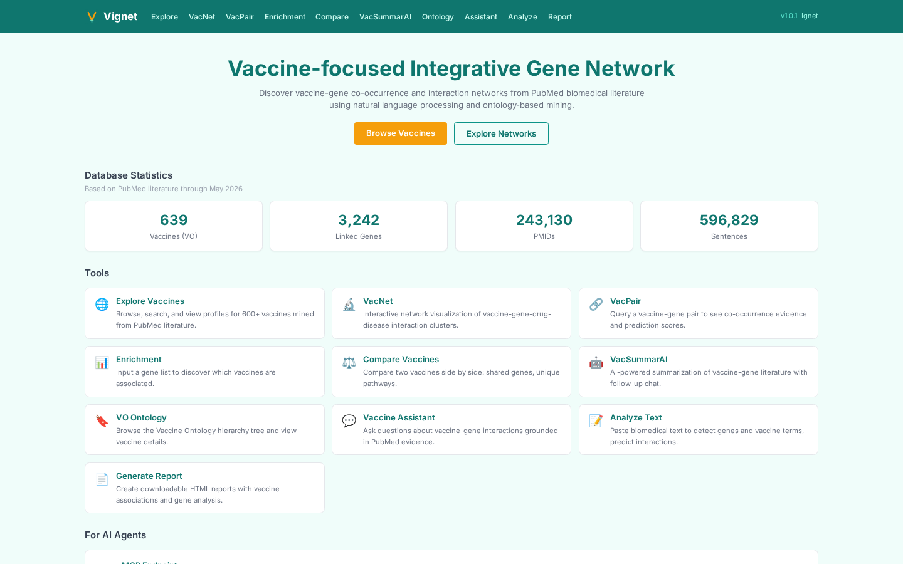

> **Vignet** projects 586,455 vaccine-gene literature annotations onto the
> Vaccine Ontology and lets you build heterogeneous vaccine-gene-drug-disease
> networks, run vaccine enrichment on a gene list, compare vaccines side-by-side,
> and ask vaccine-specific questions with PMID-grounded answers. Sister site to
> [Ignet](https://github.com/hurlab/Ignet), sharing the same backend and
> database.

---

## Table of contents

- [What is Vignet?](#what-is-vignet)
- [Quick start (5 minutes)](#quick-start-5-minutes)
- [Database at a glance](#database-at-a-glance)
- [Visual tour](#visual-tour)
  - [Browsing the vaccine universe](#browsing-the-vaccine-universe)
  - [Network construction and pairwise evidence](#network-construction-and-pairwise-evidence)
  - [Enrichment and comparison](#enrichment-and-comparison)
  - [AI-augmented tools](#ai-augmented-tools)
  - [Reference and onboarding](#reference-and-onboarding)
- [Use case walkthroughs](#use-case-walkthroughs)
  - [Walkthrough 1 — COVID-19 vaccine mechanism via VacNet](#walkthrough-1--covid-19-vaccine-mechanism-via-vacnet)
  - [Walkthrough 2 — Vaccine identification from a gene list](#walkthrough-2--vaccine-identification-from-a-gene-list)
  - [Walkthrough 3 — Cross-vaccine comparison](#walkthrough-3--cross-vaccine-comparison)
  - [Walkthrough 4 — AI summary of a vaccine-gene pair](#walkthrough-4--ai-summary-of-a-vaccine-gene-pair)
- [REST API](#rest-api)
  - [curl examples](#curl-examples)
  - [Python client examples](#python-client-examples)
  - [JavaScript client examples](#javascript-client-examples)
- [MCP — Model Context Protocol](#mcp--model-context-protocol)
  - [Connecting Claude Desktop](#connecting-claude-desktop)
- [System architecture](#system-architecture)
- [Vaccine Ontology integration](#vaccine-ontology-integration)
- [Self-hosting](#self-hosting)
- [Database schema](#database-schema)
- [Performance and benchmarks](#performance-and-benchmarks)
- [FAQ](#faq)
- [Troubleshooting](#troubleshooting)
- [Roadmap](#roadmap)
- [Related projects](#related-projects)
- [Citation](#citation)
- [Funding](#funding)
- [License](#license)
- [Contact](#contact)

---

## What is Vignet?

Vignet (Vaccine-focused Integrative Gene Network) is the **vaccine-first** view
into the same literature-mining substrate that powers
[Ignet](https://github.com/hurlab/Ignet). Where Ignet is organized around
genes, Vignet is organized around vaccines — specifically around the 6,796
terms of the [Vaccine Ontology (VO)](https://github.com/vaccineontology/VO).

It answers the questions vaccine researchers actually ask:

- *What genes does this vaccine interact with in the literature, and through
  which pathways?*
- *How do mRNA-platform vaccines compare to inactivated-virus vaccines in their
  gene targets?*
- *Given a gene signature from my data, which vaccines are most associated
  with it in PubMed?*
- *Summarize what the literature says about IL-6 in the context of influenza
  vaccine response.*

Vignet runs against:

- **586,455 vaccine-mention annotations** (`t_vo`) over **240,000+ PubMed
  abstracts** with vaccine content.
- **666 navigable VO terms** — 598 with direct gene evidence, plus 68
  ancestor terms reached via recursive hierarchy walking.
- Three heterogeneous **co-occurrence tables** that drive vaccine-gene,
  vaccine-drug, and vaccine-disease network edges in real time.
- The same **5.1 M BioBERT-scored gene-gene pairs** that Ignet uses, joined
  in at query time for cross-entity network rendering.

**Live site:** <https://ignet.org/vignet/>
**Sister site:** <https://ignet.org/ignet/> ([Ignet repo](https://github.com/hurlab/Ignet))
**API base:** `https://ignet.org/api/v1/`
**MCP endpoint:** `https://ignet.org/api/v1/mcp`

---

## Quick start (5 minutes)

### 1. Open the site

Go to <https://ignet.org/vignet/>. The home page lists 11 tool cards and the
shared MCP card.

### 2. Try the four flagship tools

| Try this | Click here | What you'll see |
|---|---|---|
| Browse all vaccines | <https://ignet.org/vignet/explore> | Searchable list of 638 vaccines, sortable by mention count and gene-evidence count |
| Vaccine profile (COVID-19) | <https://ignet.org/vignet/vaccine?vo=VO_0004908> | Top genes, top drugs, top diseases for the COVID-19 vaccine class |
| Build a vaccine network | <https://ignet.org/vignet/vacnet?vo=VO_0004908> | Cytoscape network with genes, drugs, diseases, cross-entity edges, and implicit ancestor walking |
| Vaccine-gene Q&A | <https://ignet.org/vignet/assistant> | Evidence-grounded answers with PMID citations |

### 3. Hit the API

```bash
# How many vaccines have gene evidence right now?
curl -s https://ignet.org/api/v1/vaccine/stats | python3 -m json.tool
```

### 4. Connect Claude Desktop (optional)

```json
{
  "mcpServers": {
    "vignet": {
      "url": "https://ignet.org/api/v1/mcp",
      "transport": "streamable-http"
    }
  }
}
```

Restart Claude Desktop. Try: *"Using vignet, find the top 10 genes associated
with COVID-19 vaccine and explain their role in vaccine-induced immunity."*

---

## Database at a glance

| Quantity | Count | Source |
|---|---:|---|
| Vaccine Ontology terms in tree | 6,796 | `t_vo_hierarchy` |
| Vaccines with gene evidence (direct + ancestor-walking) | **666** | `t_vo_has_gene_data` |
| Vaccine mention annotations in PubMed | 586,455 | `t_vo` |
| Vaccine-annotated PMIDs | ~240,000 | distinct `pmid` in `t_vo` |
| Vaccine ↔ gene co-occurrences | 7,960 | `t_cooccurrence_vo_gene` |
| Vaccine ↔ drug co-occurrences | 6,495 | `t_cooccurrence_vo_drug` |
| Vaccine ↔ disease co-occurrences | 9,990 | `t_cooccurrence_vo_hdo` |
| Gene-gene pairs available for cross-vaccine analysis | 5,124,468 | shared `t_gene_pairs` |
| Database currency | `pubmed26n1434` (May 4, 2026) | `last_processed_number.txt` |

The database is updated **daily** by the shared
[Ignet pipeline](https://github.com/hurlab/Ignet#data-pipeline). Any new
PubMed abstract that mentions a VO-listed vaccine is mined, scored, and
loaded the same night.

---

## Visual tour

Vignet has **14 SPA pages** built on a React 19 + Vite 8 stack with a teal
color theme. Screenshots below are live captures.

### Browsing the vaccine universe

**Home** — vaccine stats, 11 tool cards, MCP card, link to Ignet.


**Explore** — searchable, sortable list of all 638 vaccines with mention
counts and direct/inherited gene-evidence indicators.

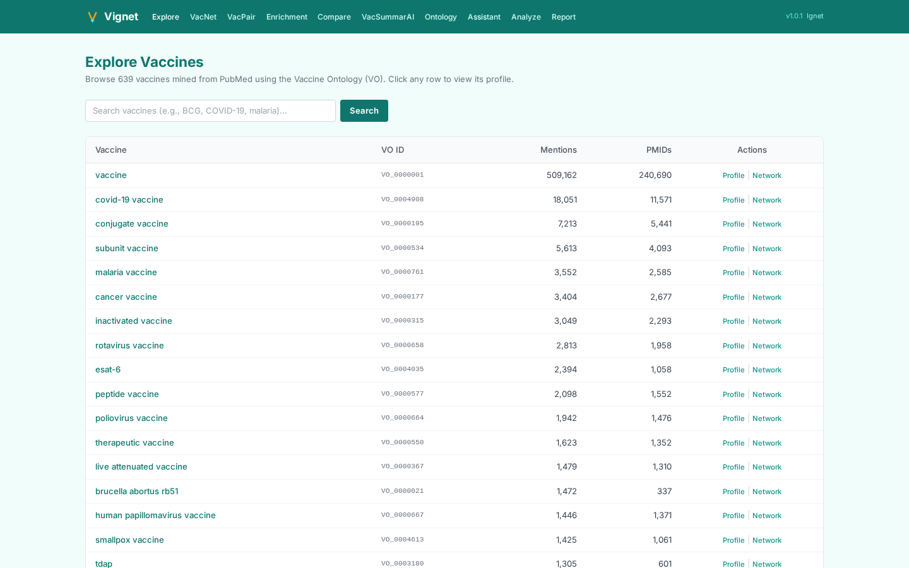

**Vaccine profile** — for any VO term, see top genes, top drugs, top diseases,
and a description. Below: the COVID-19 vaccine class (`VO_0004908`).

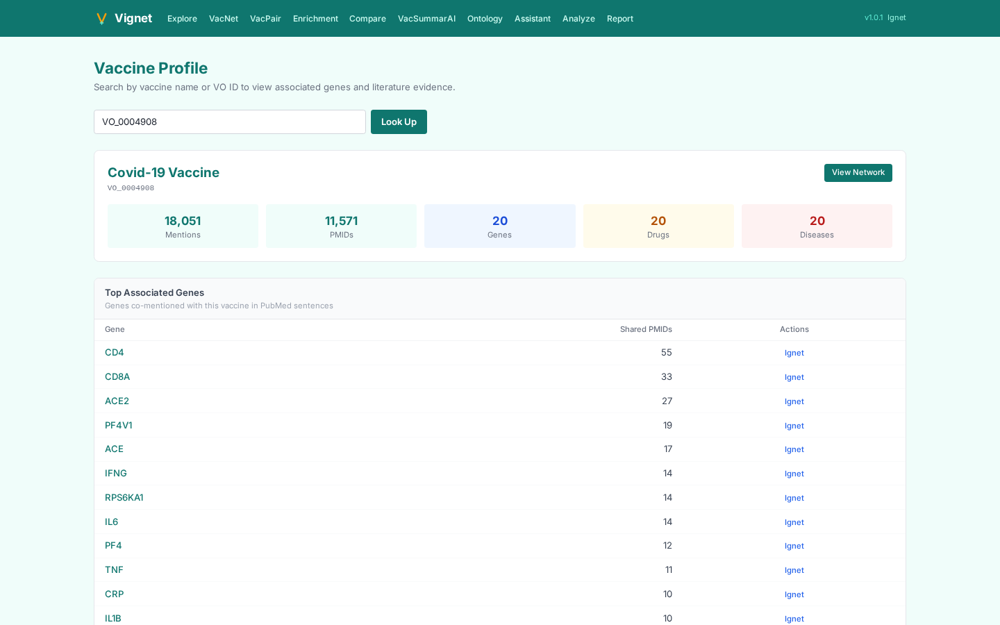

**VO Explorer** — full-page browser of the 6,796-term VO hierarchy with a
details panel. Data-bearing nodes (666 of them) are clickable; non-data nodes
are grayed.

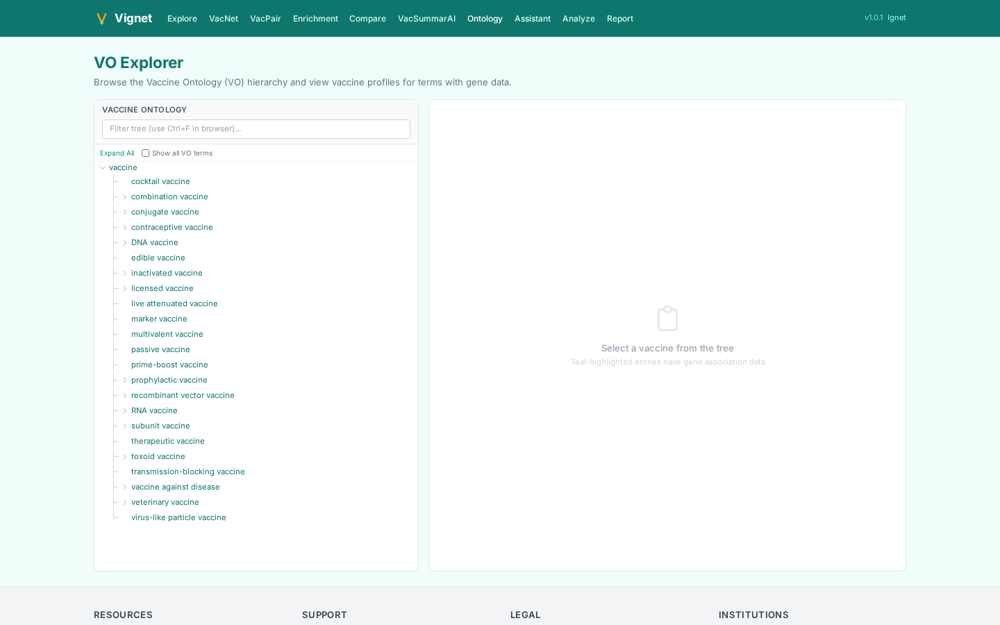

### Network construction and pairwise evidence

**VacNet** — Vignet's flagship network builder. VO sidebar on the left, a
force-directed Cytoscape network on the right, with toggles for cross-entity
edges (drug, disease) and **implicit mode** (recursively pulls evidence up
the VO hierarchy so parent terms aggregate their children's gene data).

Below: VacNet for the COVID-19 vaccine class with implicit + cross-entity
edges enabled. ~91 nodes, ~590 edges, including drugs (amber triangles) and
diseases (red hexagons) alongside gene nodes.

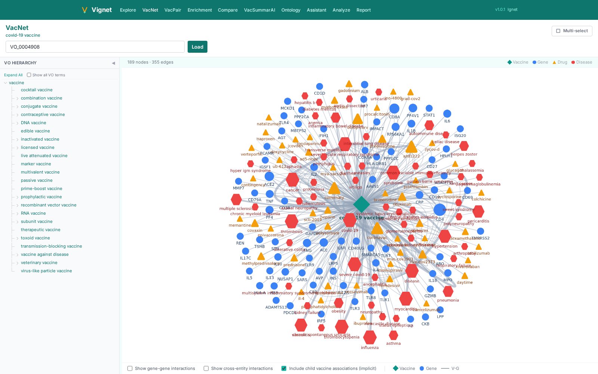

**VacPair** — for any vaccine-gene pair, see all PubMed sentences where they
co-occur, with BioBERT interaction-prediction scores. Sortable, paginated,
CSV export. Below: COVID-19 vaccine × IL6.

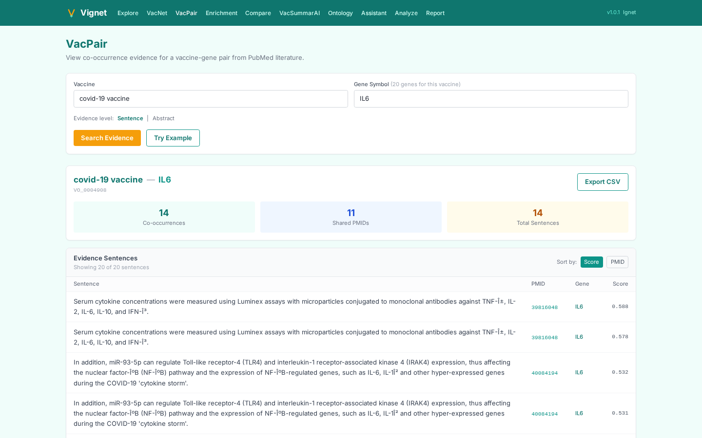

### Enrichment and comparison

**Enrichment** — paste a gene list, get a ranked list of vaccines most
associated with those genes in PubMed.

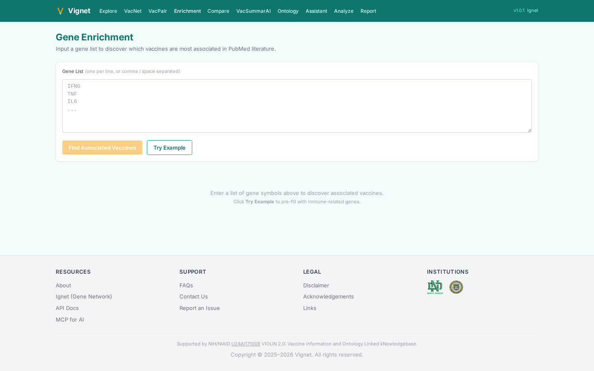

**Compare** — pick two vaccines, see shared/unique gene sets with a Venn
diagram and a sortable shared-gene table.

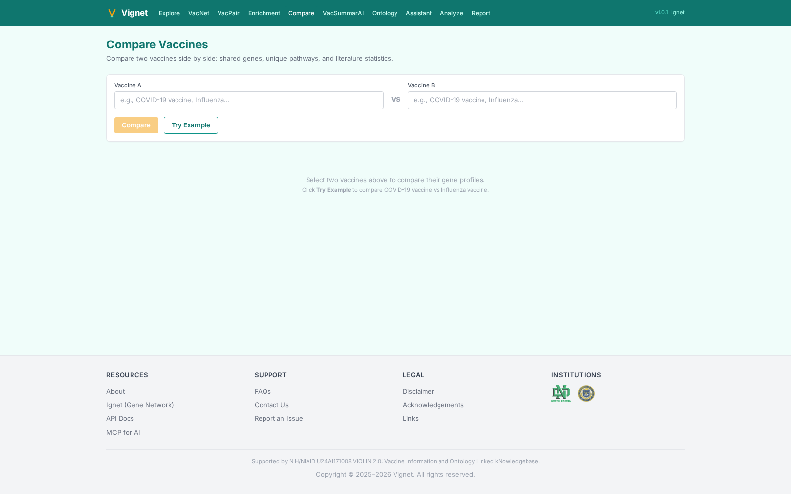

### AI-augmented tools

**VacSummarAI** — pick a vaccine and (optionally) a gene; get a GPT-4o
narrative summary of the literature with PMID citations and chat follow-up.

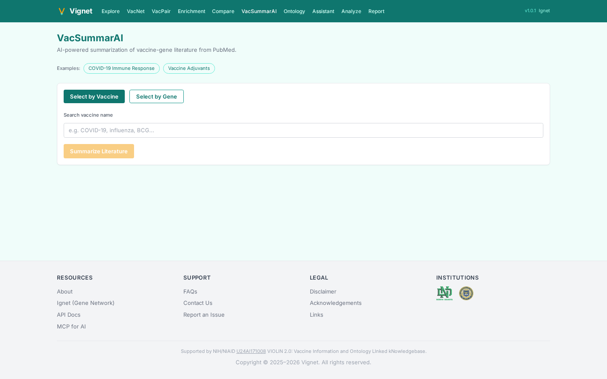

**Vaccine Assistant** — ask natural-language vaccine questions; answers are
synthesized from retrieved evidence sentences with inline PMID badges.

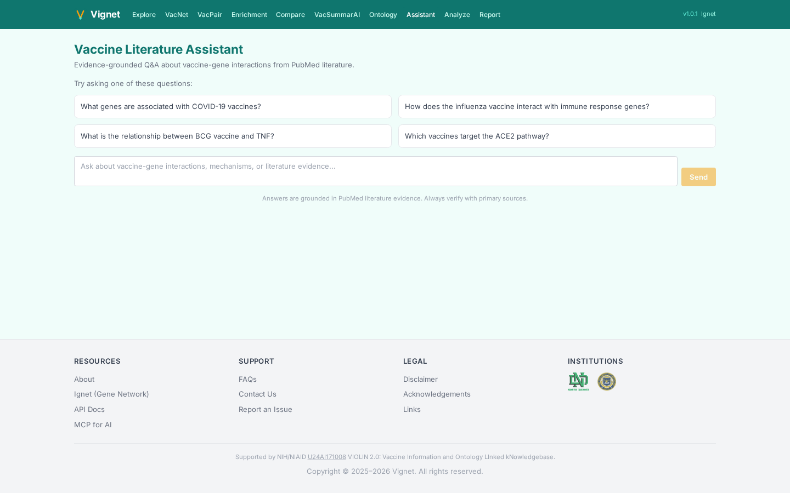

**Analyze Text** — paste a vaccine paper abstract; BioBERT detects genes and
predicts pairwise interactions.

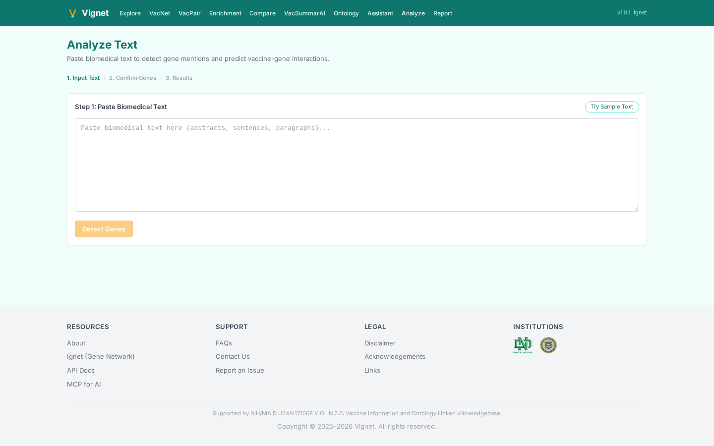

**Report** — download a multi-section HTML analysis report for a vaccine or a
gene list.

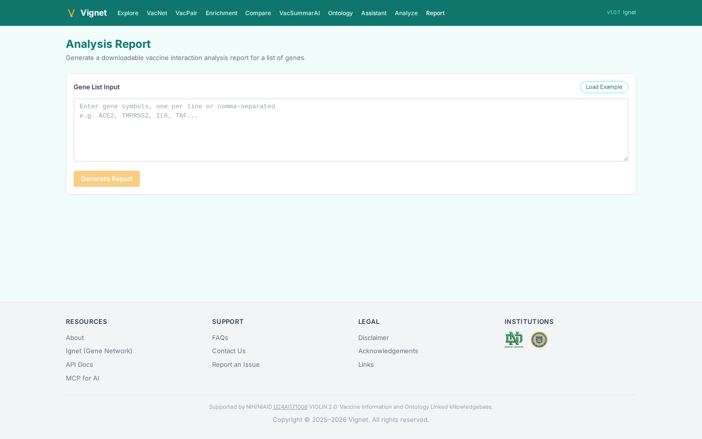

### Reference and onboarding

**About** — Vignet-specific narrative, VIOLIN 2.0 grant link, team.

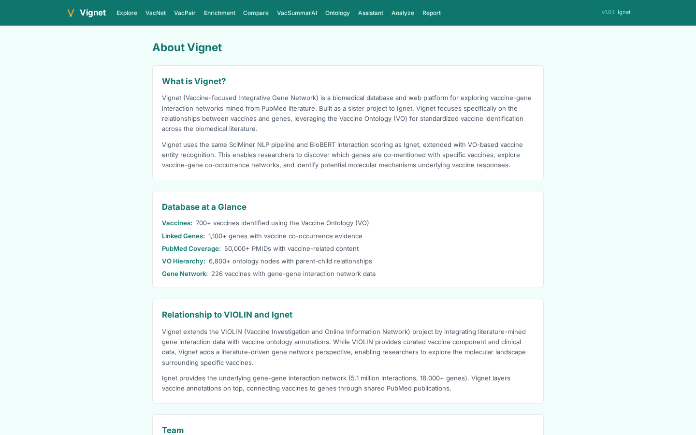

**FAQs** — 8 Vignet-specific Q&As.

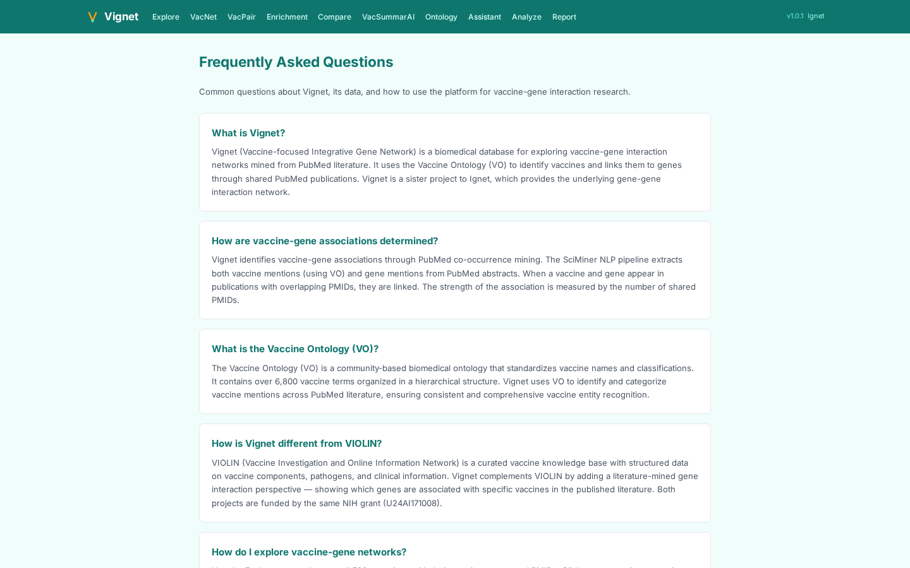

**Contact** rounds out the SPA.

---

## Use case walkthroughs

### Walkthrough 1 — COVID-19 vaccine mechanism via VacNet

**Research question.** What genes and biological processes does the literature
most associate with the COVID-19 vaccine class — and what's the surrounding
drug / disease context?

**Steps.**

1. Open <https://ignet.org/vignet/vacnet?vo=VO_0004908> (or navigate via the
   VO sidebar to "COVID-19 vaccine").
2. The page renders a force-directed network. Defaults are:
   - **Implicit mode ON** — child vaccines (`mRNA-1273`, `Comirnaty`,
     `Sputnik V`, etc.) contribute their gene evidence to the parent term.
   - **Cross-entity edges ON** — drugs (amber triangles) and diseases (red
     hexagons) appear with edges to associated genes.
3. Typical result: **≈91 nodes, ≈590 edges**. The "hub" genes you'd expect
   (ACE2, TMPRSS2, IL6, IFN family) appear prominently.
4. Click any node to see its profile, or any edge to drill down to the PMID
   evidence with BioBERT scores.
5. Use the **Export** button to download GraphML or CSV for further analysis
   in Cytoscape Desktop / Gephi.

**Why it matters.** One screen takes a vaccine-class concept to a
literature-grounded multi-entity network suitable for a manuscript figure or
hypothesis-generation session.

### Walkthrough 2 — Vaccine identification from a gene list

**Research question.** I have a 50-gene innate-immunity signature from
single-cell RNA-seq of vaccine responders. Which vaccines are most associated
with this signature in PubMed?

**Steps.**

1. Open <https://ignet.org/vignet/enrichment>.
2. Paste the gene list (one per line, comma-separated, or space-separated):
   ```
   TLR3, TLR4, TLR7, TLR9, MYD88, NLRP3, IL1B, IL6, IL18, IFNB1, IFNG,
   STAT1, STAT2, IRF3, IRF7, ISG15, OAS1, MX1, RIG-I, MAVS, NFKB1, TNF,
   CCL2, CXCL10, CD80, CD86, HLA-DRA, IFI44, IFIT1, IFITM3, ...
   ```
3. The page calls `POST /api/v1/vaccine/enrichment` and returns a ranked
   list of vaccines with:
   - **Overlap bars** — how many of your input genes co-occur with each vaccine.
   - **Enrichment score** — hypergeometric p-value with multiple-testing
     correction.
   - **Top supporting PMIDs** — drillable evidence.

**Why it matters.** Reverse-direction enrichment (gene list → vaccines) is a
unique Vignet capability — neither VIOLIN nor the VO browser supports it.

### Walkthrough 3 — Cross-vaccine comparison

**Research question.** Do mRNA platform vaccines and inactivated-virus
vaccines target overlapping genes in the literature, or are they discussed
in distinct biological contexts?

**Steps.**

1. Open <https://ignet.org/vignet/compare>.
2. Pick two vaccines:
   - Vaccine A: `mRNA-1273` (or browse via VO sidebar)
   - Vaccine B: `inactivated SARS-CoV-2 vaccine`
3. The page renders:
   - **Venn diagram** of shared vs unique genes.
   - **Shared gene pairs table** sortable by literature support.
   - **Side-by-side mini networks**.
4. Export the shared/unique gene lists.

**Why it matters.** Vaccine-platform comparisons that normally take a week of
literature curation become a single click.

### Walkthrough 4 — AI summary of a vaccine-gene pair

**Research question.** I want a citation-bearing summary of what the
literature says about IL-6 in influenza vaccine response, for a manuscript
introduction.

**Steps.**

1. Open <https://ignet.org/vignet/vacsummarai>.
2. Pick the vaccine: `influenza vaccine`.
3. Pick the gene: `IL6`.
4. Hit **Summarize**.
5. The page calls the BioSummarAI service (port 9636 → OpenAI GPT-4o) with a
   citation-forcing prompt seeded with retrieved PubMed sentences. You get
   back a structured narrative where every assertion has an inline PMID
   badge.
6. Ask a follow-up in the chat panel: *"What about the role of IL-6 in
   pediatric vs. adult vaccine response?"* — the page maintains conversation
   context.

**Why it matters.** The output is copy-pasteable into a manuscript
introduction (with citations preserved) and replaces an hour of manual
literature scanning per topic.

---

## REST API

The Vignet experience is implemented in the same Flask API that backs Ignet.
Vignet-specific endpoints live under `/api/v1/vaccine/`.

### curl examples

```bash
# Vaccine-scoped stats
curl -s https://ignet.org/api/v1/vaccine/stats | python3 -m json.tool

# Search vaccines (substring match against label + synonyms)
curl -s "https://ignet.org/api/v1/vaccine/explore?q=covid&limit=10"

# Vaccine profile (top genes, drugs, diseases)
curl -s "https://ignet.org/api/v1/vaccine/profile?vo_id=VO_0004908"

# Top genes for a vaccine
curl -s "https://ignet.org/api/v1/vaccine/top-genes?vo_id=VO_0004908&limit=20"

# Vaccine-gene pair evidence
curl -s "https://ignet.org/api/v1/vaccine/pair?vo_id=VO_0004908&gene=IL6"

# VO hierarchy (children of a node)
curl -s "https://ignet.org/api/v1/vaccine/hierarchy?vo_id=VO_0004908&data_only=true"

# Build a multi-entity network
curl -s "https://ignet.org/api/v1/vaccine/network?vo_id=VO_0004908&implicit=true&cross_entity=true"

# Vaccine enrichment from a gene list
curl -s -X POST https://ignet.org/api/v1/vaccine/enrichment \
  -H "Content-Type: application/json" \
  -d '{"genes":["IL6","TNF","IFNG","NLRP3","TLR7","STAT1"]}'

# Generic stats (database-wide, also returns data-currency)
curl -s https://ignet.org/api/v1/stats | python3 -m json.tool
```

### Python client examples

```python
"""vignet_client.py — minimal Python wrapper for the Vignet REST API."""
from __future__ import annotations
import requests
from typing import Iterable

class VignetClient:
    def __init__(self, base_url: str = "https://ignet.org/api/v1") -> None:
        self.base = base_url.rstrip("/")
        self.s = requests.Session()

    def _get(self, path: str, **params):
        r = self.s.get(f"{self.base}/{path.lstrip('/')}", params=params, timeout=30)
        r.raise_for_status()
        return r.json()

    def _post(self, path: str, json: dict):
        r = self.s.post(f"{self.base}/{path.lstrip('/')}", json=json, timeout=60)
        r.raise_for_status()
        return r.json()

    def stats(self):
        return self._get("vaccine/stats")

    def search_vaccines(self, q: str, limit: int = 10):
        return self._get("vaccine/explore", q=q, limit=limit)

    def profile(self, vo_id: str):
        return self._get("vaccine/profile", vo_id=vo_id)

    def top_genes(self, vo_id: str, limit: int = 20):
        return self._get("vaccine/top-genes", vo_id=vo_id, limit=limit)

    def pair_evidence(self, vo_id: str, gene: str, limit: int = 50):
        return self._get("vaccine/pair", vo_id=vo_id, gene=gene, limit=limit)

    def network(self, vo_id: str, implicit: bool = True, cross_entity: bool = True):
        return self._get("vaccine/network",
                         vo_id=vo_id,
                         implicit=str(implicit).lower(),
                         cross_entity=str(cross_entity).lower())

    def enrichment(self, genes: Iterable[str]):
        return self._post("vaccine/enrichment", json={"genes": list(genes)})


if __name__ == "__main__":
    v = VignetClient()

    # COVID-19 vaccine top genes
    p = v.profile("VO_0004908")
    print("COVID-19 vaccine — top genes:")
    for g in p["top_genes"][:5]:
        print(f"  {g['gene']:10s}  PMIDs={g['count']}")

    # Reverse enrichment from a gene signature
    enr = v.enrichment(["IL6", "TNF", "IFNG", "NLRP3", "TLR7", "STAT1"])
    print("\nVaccines most associated with this signature:")
    for hit in enr["vaccines"][:5]:
        print(f"  {hit['label']:40s}  overlap={hit['overlap']}")
```

### JavaScript client examples

```javascript
const API = "https://ignet.org/api/v1";

async function vacGet(path, params = {}) {
  const qs = new URLSearchParams(params).toString();
  const r = await fetch(`${API}/${path}${qs ? `?${qs}` : ""}`);
  if (!r.ok) throw new Error(`${r.status} ${r.statusText}`);
  return r.json();
}

async function vacPost(path, body) {
  const r = await fetch(`${API}/${path}`, {
    method: "POST",
    headers: { "Content-Type": "application/json" },
    body: JSON.stringify(body),
  });
  if (!r.ok) throw new Error(`${r.status} ${r.statusText}`);
  return r.json();
}

// Examples
const stats   = await vacGet("vaccine/stats");
const profile = await vacGet("vaccine/profile", { vo_id: "VO_0004908" });
const network = await vacGet("vaccine/network",
                             { vo_id: "VO_0004908",
                               implicit: "true",
                               cross_entity: "true" });
const enrich  = await vacPost("vaccine/enrichment",
                              { genes: ["IL6", "TNF", "IFNG"] });
```

For the full endpoint catalog, see the live API docs at
<https://ignet.org/ignet/api-docs>.

---

## MCP — Model Context Protocol

The Vignet experience is fully accessible through the same shared MCP
endpoint that backs Ignet. Three Vignet-specific tools are exposed:

| Tool | What it does |
|---|---|
| `vignet_search_vaccines` | Substring search over the Vaccine Ontology (labels + synonyms) |
| `vignet_get_vaccine_genes` | Top genes associated with a VO term in PubMed |
| `vignet_get_vaccine_stats` | Vaccine-scoped counters |

The shared Ignet tools (gene neighbors, pair evidence, enrichment, stats) are
available on the same endpoint so a single MCP server gives you both
vaccine-first and gene-first access in one config.

### Connecting Claude Desktop

```json
{
  "mcpServers": {
    "vignet": {
      "url": "https://ignet.org/api/v1/mcp",
      "transport": "streamable-http"
    }
  }
}
```

Restart Claude Desktop. Example prompts:

> *"Using vignet, find the top 10 genes associated with influenza vaccine, then
> explain their role in vaccine-induced immunity with PMID citations."*

> *"Compare COVID-19 vaccine and influenza vaccine in their associated genes.
> Which genes are shared, which are unique?"*

> *"I have these genes from an RNA-seq experiment on vaccine responders:
> TLR7, MYD88, IRF7, ISG15, OAS1, IFI44, IFIT1, MX1. Which vaccines is this
> signature most associated with in the literature?"*

### Raw MCP call

```bash
curl -s -X POST https://ignet.org/api/v1/mcp \
  -H "Content-Type: application/json" \
  -d '{
    "jsonrpc":"2.0","id":1,
    "method":"tools/call",
    "params":{
      "name":"vignet_get_vaccine_genes",
      "arguments":{"vo_id":"VO_0004908","limit":10}
    }
  }'
```

---

## System architecture

Vignet is a React 19 SPA. The Vignet experience is achieved by the **same**
Flask API querying the **same** MariaDB database that Ignet uses — there is
no separate Vignet database. The vaccine view is a query-time projection.

```
                                Internet
                                   │
                              ┌────▼─────┐
                              │ Apache   │  /vignet/, /ignet/, /api/v1/
                              └────┬─────┘
                                   │
                  ┌────────────────┴────────────────┐
                  │                                 │
        ┌─────────▼──────────┐         ┌────────────▼────────┐
        │ Vignet SPA          │         │ Ignet SPA            │
        │ /vignet/dist-react/ │         │ /ignet/dist-react/   │
        │ 14 pages            │         │ 21 pages             │
        └─────────┬───────────┘         └────────────┬─────────┘
                  │  fetch /api/v1/*                  │
                  └──────────────────┬────────────────┘
                                     │
                         ┌───────────▼──────────┐
                         │ Flask + Waitress API │
                         │ 127.0.0.1:9637       │
                         └──┬──────┬──────┬─────┘
                            │      │      │
                  ┌─────────▼──┐  ┌▼─────┐ ┌▼──────────────┐
                  │ MariaDB    │  │Redis │ │ BioBERT :9635  │
                  │ db=ignet   │  │24h   │ │ BioSummarAI    │
                  │ (shared)   │  │cache │ │ :9636          │
                  └────────────┘  └──────┘ └────────────────┘
```

For the full architecture writeup including the daily PubMed update
pipeline, see the
[Ignet architecture document](https://github.com/hurlab/Ignet/blob/main/docs/IGNET_VIGNET_INTRODUCTION.md).

---

## Vaccine Ontology integration

Vignet's information architecture is organized around the
[Vaccine Ontology (VO)](https://github.com/vaccineontology/VO), a curated
OBO Foundry ontology of vaccines, vaccine components, and vaccine-related
concepts.

### Three VO-driven mechanisms

1. **Direct annotation** — every `t_vo` row links a PubMed sentence to a VO
   term. The page-level Vaccine Profile uses these to compute "top genes /
   drugs / diseases" via the heterogeneous co-occurrence tables.
2. **Hierarchy walking (implicit mode)** — VO is a tree with 6,796 nodes;
   only 598 have direct evidence. VacNet's *implicit* mode runs a recursive
   CTE that walks descendants and aggregates their associations to the
   current parent, so a click on `coronavirus vaccine` automatically pulls
   in evidence from `COVID-19 vaccine`, `mRNA-1273`, `Comirnaty`, etc.
3. **Ancestor-walking lookup** (`t_vo_has_gene_data`) — rebuilt by
   `scripts/04_rebuild_vo_gene_data.sql`, this table marks 666 navigable VO
   IDs (598 direct + 68 ancestors). The VO Explorer uses it to decide which
   nodes are clickable.

### Cross-entity edges

The Vignet network is **heterogeneous**: it contains four node types and four
edge types.

| Node type | Source | Visual |
|---|---|---|
| Vaccine (parent of network) | `t_vo_hierarchy` | central / labeled |
| Gene | `t_gene_pairs` ∩ VO PMIDs | round, blue |
| Drug | `t_cooccurrence_drug_gene`, `t_cooccurrence_vo_drug` | triangle, amber |
| Disease | `t_cooccurrence_hdo_gene`, `t_cooccurrence_vo_hdo` | hexagon, red |

| Edge type | Source table | Meaning |
|---|---|---|
| Vaccine ↔ Gene | `t_cooccurrence_vo_gene` | Co-mention in the same sentence/PMID |
| Vaccine ↔ Drug | `t_cooccurrence_vo_drug` | Co-mention |
| Vaccine ↔ Disease | `t_cooccurrence_vo_hdo` | Co-mention |
| Gene ↔ Gene | `t_gene_pairs` | BioBERT-scored protein-protein interaction |

---

## Self-hosting

Vignet is a thin SPA built against the shared Ignet backend. To self-host
the full stack:

1. **Set up Ignet first.** Follow
   <https://github.com/hurlab/Ignet#self-hosting> for the API, database, and
   BioBERT / BioSummarAI services.
2. **Build Vignet:**
   ```bash
   git clone https://github.com/hurlab/Vignet.git
   cd Vignet/frontend
   npm install
   npm run build      # outputs to ../dist-react/
   ```
3. **Configure Apache** to serve `/vignet/dist-react/` and reverse-proxy
   `/api/v1/*` to the Ignet Flask API.

### Frontend dev server

```bash
cd Vignet/frontend
# .env (optional):
#   VITE_API_PROXY_TARGET=http://127.0.0.1:9637
npm run dev    # http://localhost:5174
```

The dev server proxies `/api/v1/*` to your local Ignet backend.

### Production .htaccess

Vignet's `dist-react/` needs the same SPA fallback rewrite as Ignet:

```apache
Options -MultiViews
DirectoryIndex index.html
<IfModule mod_rewrite.c>
  RewriteEngine On
  RewriteBase /vignet/
  RewriteRule ^index\.html$ - [L]
  RewriteCond %{REQUEST_FILENAME} !-f
  RewriteCond %{REQUEST_FILENAME} !-d
  RewriteRule . index.html [L]
</IfModule>
```

---

## Database schema

Vignet uses the **same** `ignet` MariaDB database as Ignet. Vignet's
distinguishing tables:

| Table | Rows | Purpose |
|---|---:|---|
| `t_vo` | 586,455 | Vaccine mention annotations (`sentence_id`, `pmid`, `vo_id`, `matching_phrase`) |
| `t_vo_hierarchy` | 6,796 | VO ontology tree (parent–child) |
| `t_vo_has_gene_data` | 666 | Navigable VO IDs (direct + ancestor-walked) |
| `t_cooccurrence_vo_gene` | 7,960 | Vaccine ↔ gene co-occurrence pairs |
| `t_cooccurrence_vo_drug` | 6,495 | Vaccine ↔ drug |
| `t_cooccurrence_vo_hdo` | 9,990 | Vaccine ↔ disease |
| `t_gene_pairs` (shared) | 5,124,468 | Gene-gene BioBERT-scored pairs |
| `t_sentences` (shared) | 1,898,655 | Sentence text for gene pairs |

Schema dump: <https://github.com/hurlab/Ignet/blob/main/scripts/schema_ignet.sql>.

---

## Performance and benchmarks

| Operation | Typical latency |
|---|---|
| `/api/v1/vaccine/stats` | ~10 ms |
| `/api/v1/vaccine/profile?vo_id=…` | ~150 ms |
| `/api/v1/vaccine/top-genes` | ~80 ms |
| `/api/v1/vaccine/network` (gene-only mode, ~50 nodes) | ~500 ms |
| `/api/v1/vaccine/network` (implicit + cross-entity, ~200 nodes) | ~1.5 s |
| `/api/v1/vaccine/enrichment` (50-gene list) | ~700 ms |
| VacNet client-side render (Cytoscape force-directed, 200 nodes) | ~3 s |

The co-occurrence tables (~660 K pre-computed pairs) keep VacNet
interactive — runtime JOINs across the 5 M-row `t_gene_pairs` would be far
slower.

---

## FAQ

**Q. What's the difference between Vignet and VIOLIN?**
[VIOLIN](http://www.violinet.org/) is the comprehensive vaccine knowledge
base — curated vaccine records, components, host responses, adverse events.
Vignet is the **literature-mining** view: it surfaces gene-vaccine
co-occurrences from PubMed at sentence-level granularity with BioBERT
scoring. The two projects are complementary and share funding
(NIH U24AI171008 VIOLIN 2.0).

**Q. Why does Vignet only show 666 vaccines when VO has 6,796 terms?**
VO is a tree; the leaves are concrete vaccine products and the higher levels
are categories ("viral vaccine", "subunit vaccine", etc.). 598 VO terms
have direct gene evidence in the literature, and 68 more become navigable
because ancestor-walking aggregates their children's evidence. The remaining
~6,130 terms have no literature support yet — they are still browsable in
the VO Explorer but appear grayed out.

**Q. How does Vignet handle vaccine synonyms (e.g., "Comirnaty" vs
"Pfizer-BioNTech COVID-19 vaccine")?**
VO itself maintains synonyms; the daily mining pipeline matches against
all VO labels and synonyms when annotating sentences. So a sentence
mentioning "BNT162b2" gets the same `vo_id` as one mentioning "Comirnaty".

**Q. Are the gene-vaccine associations causal or just statistical
co-occurrence?**
**Strictly co-occurrence.** Two entities mentioned in the same PubMed
sentence are co-occurring; this does not imply the sentence describes a
causal relationship between them. Use the BioBERT score on the underlying
gene-gene evidence sentences as a proxy for interaction confidence, and
**always verify in primary literature** before drawing biological
conclusions.

**Q. Why are some VO IDs returning 404 in `/api/v1/vaccine/profile`?**
A 404 means no PubMed evidence for that VO term, even after
ancestor-walking. Use `/api/v1/vaccine/hierarchy?vo_id=…&data_only=true` to
get the tree pruned to data-bearing nodes.

**Q. How fresh is the data?**
Vignet inherits Ignet's daily-update cadence — typically 2–4 days from
PubMed indexing to Vignet visibility. The `/api/v1/stats` endpoint exposes
the exact NCBI release date of the most recently processed PubMed update
file as `data_last_updated`.

**Q. Can I export the networks?**
Yes — VacNet's **Export** button supports GraphML (for Cytoscape Desktop or
Gephi) and CSV (edge list).

---

## Troubleshooting

**The VO Explorer shows mostly grayed-out nodes.**
That's expected — only 666 of 6,796 VO terms have literature evidence.
Toggle the "Show all VO terms" switch to gray out the non-data nodes; the
default `data_only=true` view is the most useful for exploration.

**VacNet for a parent vaccine is empty even though I know children have data.**
Make sure **Implicit mode** is ON (it is by default). Without implicit mode,
only direct VO annotations count, and parent categories often have none.

**Enrichment returns no results for a large gene list.**
Vaccine enrichment requires gene-vaccine co-occurrence in the literature. A
purely housekeeping-gene list (GAPDH, ACTB, etc.) will likely have no
vaccine associations.

**The Vaccine Assistant says "no evidence found."**
The Assistant only synthesizes from indexed sentences. If your question is
about a topic with sparse vaccine-gene literature, broaden the question or
check via VacPair / VacNet whether evidence exists at all.

---

## Roadmap

- [ ] **Full VIOLIN data integration** — bring in curated VIOLIN vaccine
      records (components, host responses, adverse events) alongside the
      literature-mined view.
- [ ] **Cross-file co-occurrence recompute** — currently daily mode generates
      within-file pairs only; cross-file pairs are rebuilt periodically.
- [ ] **PMC full-text mining** — extend beyond abstracts to PubMed Central
      open-access full text.
- [ ] **Vaccine timeline** — temporal view of when each vaccine entered the
      literature and how its gene context evolved.
- [ ] **Interactive Venn cross-vaccine analysis** — three-way and four-way
      vaccine comparisons.
- [ ] **VO Explorer search** — substring search across all VO terms (not
      just data-bearing).
- [ ] **Citation DOI** — Zenodo workflow for formal citation.

---

## Related projects

- **[Ignet](https://github.com/hurlab/Ignet)** — gene-first sister site
  running on the same backend (public repo).
- **[VIOLIN](http://www.violinet.org/)** — comprehensive curated vaccine
  knowledgebase (shared funding under NIH U24AI171008).
- **[Vaccine Ontology (VO)](https://github.com/vaccineontology/VO)** —
  the organizing ontology behind Vignet.
- **[BioBERT](https://github.com/dmis-lab/biobert)** — biomedical BERT
  model used for protein-interaction scoring.
- **[Model Context Protocol](https://spec.modelcontextprotocol.io/)** —
  the protocol Vignet's MCP endpoint implements.

---

## Citation

If you use Vignet in published work, please cite:

```bibtex
@misc{vignet2026,
  title        = {Vignet: A Vaccine-Focused Integrative Gene Network from
                  PubMed Literature Mining with BioBERT Scoring},
  author       = {Hur, Junguk and He, Yongqun},
  year         = {2026},
  howpublished = {\url{https://ignet.org/vignet/}},
  note         = {Sister site to Ignet; shares the underlying database.
                  Supported by NIH/NIAID U24AI171008 (VIOLIN 2.0)}
}
```

Example in-text citation:

> "Vaccine-gene associations were derived using Vignet, a vaccine-focused
> integrative gene network platform built on 586,455 Vaccine Ontology
> annotations spanning ~240,000 PubMed abstracts (Hur and He, 2026). Networks
> were generated by VacNet with implicit ancestor walking and cross-entity
> edges enabled, drawing on the heterogeneous co-occurrence tables shared
> with the parent Ignet platform (5.1 M BioBERT-scored gene-gene pairs)."

---

## Funding

- **NIH/NIAID U24AI171008** — VIOLIN 2.0 (Vaccine Information and Ontology
  Linked kNowledgebase)
- University of North Dakota — Department of Biomedical Sciences
- University of Michigan — Medical School

---

## License

[MIT License](LICENSE). Vignet data is derived from publicly available PubMed
abstracts and the Vaccine Ontology, provided as-is for research and
educational purposes. Computational co-occurrence is not experimental
validation — always verify findings in primary literature.

---

## Contact

- **Live site:** <https://ignet.org/vignet/>
- **Issues:** <https://github.com/hurlab/Vignet/issues>
- **Email:** <hurlabshared@gmail.com>
- **User manual:** [`docs/USER_MANUAL.md`](docs/USER_MANUAL.md)
- **Manuscript-prep introduction:**
  [`docs/IGNET_VIGNET_INTRODUCTION.md`](https://github.com/hurlab/Ignet/blob/main/docs/IGNET_VIGNET_INTRODUCTION.md)
  (lives in the Ignet repo, covers both projects)
- **API docs (live):** <https://ignet.org/ignet/api-docs>

---

## Team

- **Junguk Hur, Ph.D.** — Lab PI, University of North Dakota (Biomedical Sciences)
- **Yongqun "Oliver" He, Ph.D.** — Co-PI, University of Michigan (Medical School)
- And the Hur Lab and Vignet contributor community

---

## Changelog

### 1.1.0 — 2026-04-14 (sync with Ignet public release)

- Updated to reflect Ignet's public release; clarified shared-database
  architecture.
- Expanded README with worked examples, code samples, and MCP setup.

### 1.0.0 — 2026-03-31 (Vignet feature-complete)

- All 14 SPA pages live: Home, Explore, Vaccine, VacNet, VacPair, Enrichment,
  Compare, VacSummarAI, VO Explorer, Vaccine Assistant, Analyze Text, Report,
  About, FAQs.
- Two new vaccine-specific API endpoints: `/vaccine/pair`, `/vaccine/enrichment`.
- Heterogeneous knowledge-graph rendering in VacNet (genes + drugs + diseases).
- Implicit hierarchy walking and cross-entity edges in VacNet.

### 0.x — 2026-03 (Vignet launch)

- Initial Vignet SPA on top of the shared Ignet backend.
- VacNet, Explore, Vaccine pages.

---

**Last updated:** 2026-05-12
**Version:** 1.1.0
**Database:** `pubmed26n` (file 1434, May 4, 2026)
**Copyright** © 2025–2026 Vignet. Developed by Hur Lab (UND) & He Lab (UM).
