# Vignet User Manual

## Introduction

**Vignet** is a specialized database and web platform for exploring vaccine-gene associations discovered through biomedical literature mining. It enables researchers to uncover vaccine mechanisms, identify gene targets, and analyze the biological relationships between vaccines and the genes they interact with.

### What Vignet Does

Vignet integrates multiple data sources to create a comprehensive, searchable resource of vaccine-gene interactions:

- **PubMed Literature Mining**: Extracts mentions of vaccines and genes from 240,127 PubMed abstracts
- **Vaccine Ontology (VO)**: Organizes 638 vaccine terms into a hierarchical classification system
- **BioBERT Prediction**: Uses machine learning to predict protein-gene interactions beyond explicit mentions
- **Co-occurrence Analysis**: Discovers relationships through sentence-level and abstract-level evidence

### Who Should Use Vignet

Vignet is designed for:

- **Bioinformatics Researchers**: Analyzing genome-wide studies and interpreting gene lists
- **Immunologists**: Understanding vaccine mechanisms and immune response pathways
- **Vaccine Scientists**: Investigating vaccine targets and comparative efficacy
- **Pharmaceutical Researchers**: Exploring drug-gene-vaccine interactions
- **AI Researchers**: Leveraging the MCP API for language model integration

### Data Coverage

The database contains:

- **638 Vaccines**: Organized into 6.8K ontology nodes covering vaccine types, formulations, and targets
- **3,242 Linked Genes**: Human genes with documented vaccine associations
- **240,127 PubMed Articles**: With 586,455 extracted vaccine-gene sentence mentions
- **Continuous Updates**: Literature mined through 2025 with regular database refreshes

---

## Getting Started

### Accessing Vignet

Navigate to **https://ignet.org/vignet/** in your web browser. The platform works best in modern browsers (Chrome, Firefox, Safari, Edge) with JavaScript enabled.

### The Home Page

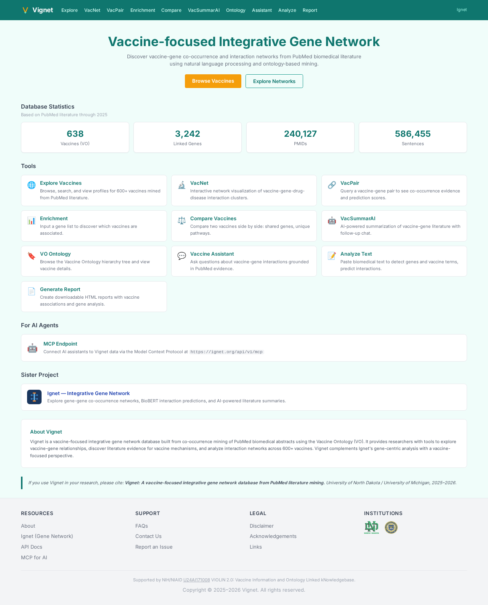

The home page provides an overview of Vignet and quick access to all major tools:

**Header Navigation**: The top navigation bar contains links to all tools and the main Ignet platform. Click the Vignet logo to return home anytime.

**Database Statistics**: Key metrics showing the scale of Vignet's data:
- 638 total vaccines in the Vaccine Ontology
- 3,242 genes with documented vaccine associations
- 240,127 PubMed articles analyzed
- 586,455 extracted vaccine-gene mentions

**Main Tools**: Browse all seven interactive tools with descriptions below the statistics.

**For AI Agents**: Information about the MCP (Model Context Protocol) endpoint for integrating Vignet with AI assistants and Claude-based applications.

**Sister Project**: Link to Ignet, the complement database for general gene-gene interactions.

**Quick Tips**:
- Click "Browse Vaccines" to explore the complete vaccine list
- Click "Explore Networks" to visualize vaccine-gene interaction networks
- Use the search bar on the Explore page to find specific vaccines

---

## Tools

### Explore Vaccines

**Purpose**: Browse the complete vaccine catalog, search by name or VO ID, and view detailed vaccine profiles including associated genes and supporting evidence.

**How to Use**:

1. **Basic Search**: Enter a vaccine name or ID in the search field (e.g., "COVID-19", "BCG", "influenza"). The search supports partial matches and is case-insensitive.

2. **Browse the List**: Scroll through 50 vaccines per page. Use "Next" and "Previous" buttons to navigate. Columns show:
   - **Vaccine Name**: The vaccine term from the Vaccine Ontology
   - **VO ID**: Unique identifier (e.g., VO_0000001)
   - **Mentions**: Number of sentences containing this vaccine in PubMed
   - **PMIDs**: Number of unique articles mentioning this vaccine
   - **Actions**: "Profile" to view vaccine details, "Network" to visualize interactions

3. **View a Vaccine Profile**: Click the "Profile" button to open an inline panel showing:
   - **Top Associated Genes**: Ranked by co-occurrence frequency with color-coded scores
   - **Gene Association Details**: Number of sentences and articles for each gene
   - **Evidence Level**: Indicators for sentence vs. abstract level mentions

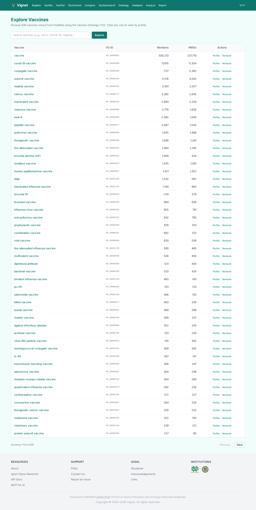

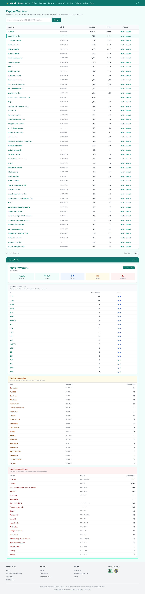

**Understanding the Results**:

- **Mention Count**: Higher numbers indicate more literature coverage. Popular vaccines like COVID-19 have thousands of mentions.
- **PMID Count**: The number of unique articles. Often lower than mention count because a vaccine may be discussed multiple times in one paper.
- **Gene Color Coding**: Red indicates strong associations, yellow moderate, green weaker associations based on co-occurrence frequency.

**Tips for Better Results**:

- Use generic vaccine terms ("influenza") to see all variants; use specific terms ("inactivated influenza vaccine") for targeted searches
- Check mention counts to gauge literature availability—vaccines with low counts may have limited evidence
- Click gene names in profiles to view more details about that vaccine-gene pair in VacPair

---

### VacNet — Network Visualization

**Purpose**: Visualize the relationships between vaccines, genes, drugs, and diseases as an interactive network graph. Understand how vaccines cluster with genes and explore cross-entity connections.

**How to Use**:

1. **Select Vaccines**: Use the VO Hierarchy tree on the left to select one or more vaccines. Click the checkboxes or click "Expand All" to see all vaccine categories.

2. **Load the Network**: Click the "Load" button to generate the visualization. The network appears in the center panel.

3. **Explore Node Types**:
   - **Vaccine Nodes** (teal): Your selected vaccine(s)
   - **Gene Nodes** (blue): Genes associated with selected vaccines
   - **Drug Nodes** (purple): Drugs targeting those genes
   - **Disease Nodes** (orange): Diseases relevant to the pathway

4. **Toggle Connections**:
   - **Gene-Gene Interactions**: Enable to show direct protein-protein interactions between genes
   - **Cross-Entity Edges**: Show drugs and disease connections beyond basic vaccine-gene links
   - **Implicit Hierarchy**: Display hierarchical relationships within the VO tree

5. **Interact with the Graph**:
   - **Zoom**: Scroll wheel or pinch to zoom in/out
   - **Pan**: Click and drag to move around the network
   - **Node Details**: Click any node to see more information
   - **Multi-select**: Check "Multi-select" in the top right to select multiple nodes

**Understanding the Visualization**:

- **Node Size**: Represents the number of co-occurrences or connections
- **Edge Thickness**: Thicker lines indicate stronger associations
- **Clustering**: Nodes that cluster together are strongly related through literature co-occurrence
- **Color Coding**: Follows standard biological visualization: vaccines (teal), genes (blue), diseases (orange), drugs (purple)

**Tips for Exploration**:

- Start with a single popular vaccine like COVID-19 to understand network structure
- Enable gene-gene interactions to see the full functional pathway
- Use multi-select to compare networks from two related vaccines
- Check mention counts on edges to verify association strength


---

### VacPair — Vaccine-Gene Evidence

**Purpose**: Query specific vaccine-gene pairs to retrieve co-occurrence evidence, prediction scores, and supporting sentence-level citations from the literature.

**How to Use**:

1. **Enter Search Terms**:
   - **Vaccine Field**: Type the vaccine name (e.g., "COVID-19 vaccine", "BCG")
   - **Gene Field**: Enter the gene symbol (e.g., "ACE2", "TNF", "IFNG")

2. **Select Evidence Level**:
   - **Sentence Level**: Shows individual sentences containing both vaccine and gene mentions (more specific)
   - **Abstract Level**: Shows all abstracts containing mentions, regardless of proximity (broader coverage)

3. **Search**: Click "Search Evidence" to retrieve results.

4. **Review Results**:
   - **Co-occurrence Count**: Number of sentences/abstracts with both terms
   - **BioBERT Score**: Prediction confidence (0-1) that the gene interacts with the vaccine
   - **Supporting Sentences**: Actual text from PubMed showing the relationship
   - **PMID**: Link to the original PubMed article

**Understanding the Results**:

- **High Score (>0.8)**: Strong evidence of interaction, likely validated in literature
- **Medium Score (0.5-0.8)**: Moderate evidence; interaction inferred from proximity
- **Low Score (<0.5)**: Weak direct evidence; may require background knowledge to interpret
- **Sentence vs. Abstract**: Sentence-level is more precise; abstract-level includes incidental mentions

**Tips for Better Searches**:

- Use standard gene symbols (UPPERCASE, e.g., "ACE2" not "ace2")
- Try "Try Example" button to see a real example with results
- If no results appear, try a more general vaccine term
- Combine results with VacNet visualization to see context in the gene network

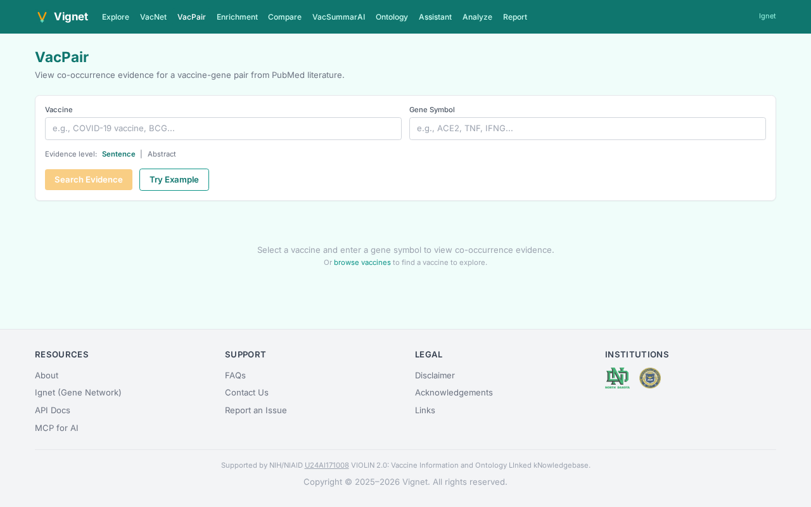

---

### Enrichment — Gene List Analysis

**Purpose**: Upload a gene list (from RNA-seq, GWAS, or other studies) and discover which vaccines are most associated with those genes in the literature.

**How to Use**:

1. **Prepare Gene List**: Format your list with one gene symbol per line or comma/space-separated on a single line (e.g., "IFNG, TNF, IL6" or one per line).

2. **Enter Genes**: Paste your gene list into the text area. The tool shows a preview with placeholder format: IFNG, TNF, IL6, ...

3. **Optional: Load Example**: Click "Try Example" to see results with a pre-loaded immune response gene list.

4. **Submit**: Click "Find Associated Vaccines" to analyze the list.

5. **Review Results**:
   - **Associated Vaccines**: Ranked by statistical significance
   - **Coverage**: How many genes in your list are associated with each vaccine
   - **Score/p-value**: Statistical measure of association strength
   - **Pathways**: Vaccine-associated biological pathways relevant to your genes

**Understanding the Results**:

- **High-Scoring Vaccines**: These vaccines target biological pathways relevant to your gene list
- **Coverage %**: The percentage of your genes with documented vaccine associations—higher is better
- **Enrichment Score**: Combines frequency and statistical significance

**Tips for Better Analysis**:

- Use 10-100 genes for best results; too few genes may not show significant enrichment
- Start with immune-related genes; Vignet specializes in immune pathways
- Cross-reference results with VacNet to see the network of interactions
- Click "Try Example" first to understand the output format

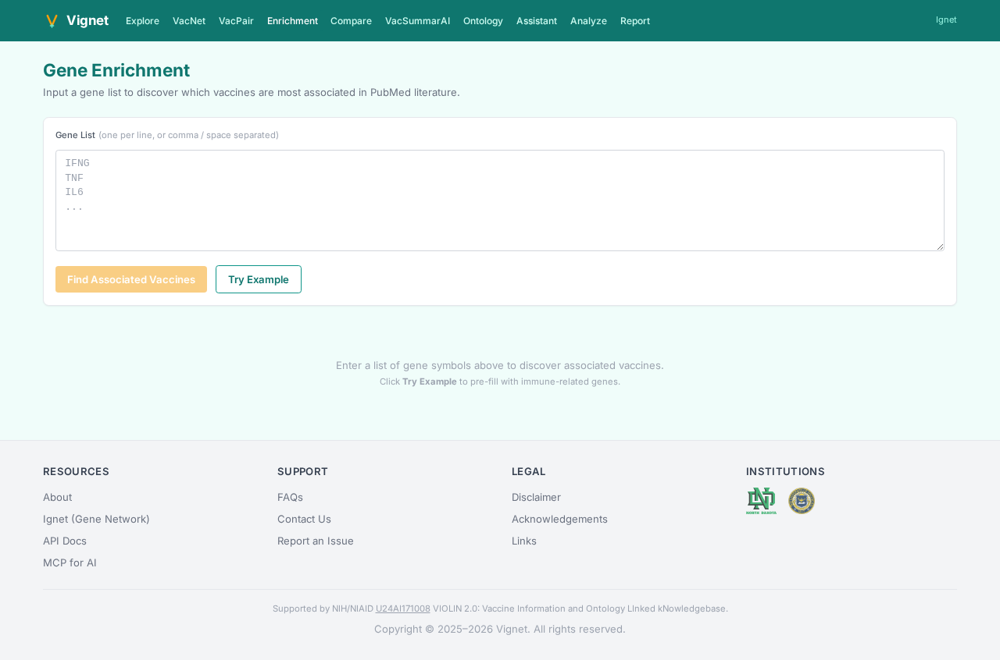

---

### Compare Vaccines

**Purpose**: Side-by-side comparison of two vaccines including shared gene targets, unique pathways, and literature statistics.

**How to Use**:

1. **Select Vaccine A**: Enter the first vaccine name in the left field (e.g., "COVID-19 vaccine").

2. **Select Vaccine B**: Enter the second vaccine in the right field (e.g., "Influenza vaccine").

3. **Compare**: Click the "Compare" button to generate the comparison.

4. **View Results**:
   - **Shared Genes**: Genes associated with both vaccines (center overlap)
   - **Unique to Vaccine A**: Genes only mentioned with the first vaccine (left side)
   - **Unique to Vaccine B**: Genes only mentioned with the second vaccine (right side)
   - **Venn Diagram**: Visual representation of overlap
   - **Statistics**: Mention counts, PMID counts, gene counts for each vaccine

5. **Interactive Exploration**: Click gene names to view VacPair evidence for that gene.

**Understanding the Venn Diagram**:

- **Center (Overlap)**: Shared targets indicate vaccines targeting similar biological pathways
- **Left Side**: Unique genes may indicate vaccine-specific mechanisms
- **Right Side**: Genes targeted by the comparison vaccine only
- **Area Size**: Proportional to number of genes (larger circles = more genes)

**Tips for Comparison**:

- Compare vaccines in the same family (e.g., two flu vaccines) to find mechanistic differences
- Compare vaccines from different families (e.g., COVID-19 vs. BCG) to discover novel connections
- Use "Try Example" to compare COVID-19 vs. Influenza vaccines
- Cross-reference results by clicking gene names to verify associations

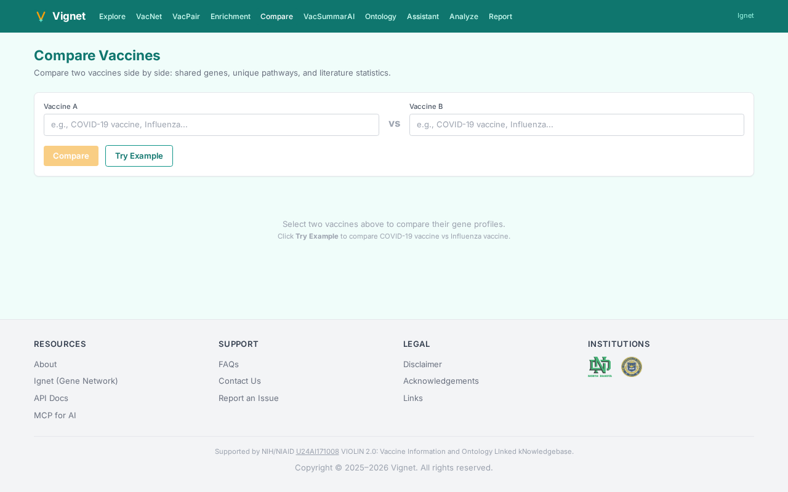

---

### VacSummarAI — AI Summarization

**Purpose**: Get AI-powered summaries of vaccine-gene relationships from literature, with the ability to ask follow-up questions and refine the analysis.

**How to Use**:

1. **Choose Input Type**:
   - **Select by Vaccine**: Click the tab and search for a vaccine name
   - **Select by Gene**: Click the tab and enter a gene symbol

2. **Select Terms**: Browse the dropdown or search to find specific vaccines or genes to summarize.

3. **Generate Summary**: Click "Summarize Literature" to create an AI-powered summary of:
   - Key findings and mechanisms
   - Associated genes (if vaccine selected) or vaccines (if gene selected)
   - Relevant biological pathways
   - Literature highlights

4. **Follow-up Questions**: The summary includes a chat interface where you can:
   - Ask for clarification on specific mechanisms
   - Request focus on specific biological pathways
   - Get recommendations for related genes/vaccines
   - Ask about evidence strength or contradictions

5. **Use Results**: Copy summary text for reports; follow-up chat provides interactive exploration.

**Understanding AI Summaries**:

- **Accuracy**: Summaries are generated from real PubMed literature and cited internally
- **Confidence**: Look for mention counts in the summary—higher numbers mean more robust findings
- **Limitations**: AI may occasionally misinterpret complex biological relationships; always verify important findings in VacPair

**Tips for Better Summaries**:

- Start with popular vaccines/genes for richest summaries (more literature available)
- Use follow-up questions to focus on your research area
- Combine with VacPair for citation-level verification
- Good for: grant writing, background research, mechanism discovery

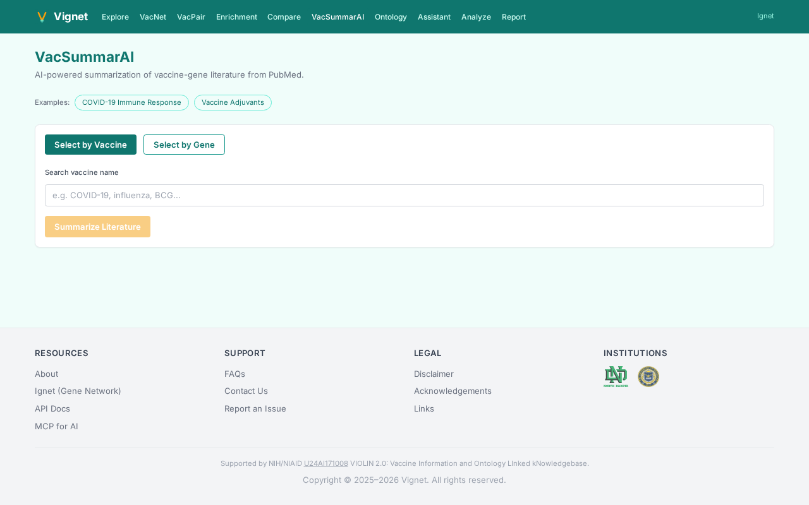

---

### Ontology Browser

**Purpose**: Explore the complete Vaccine Ontology hierarchy, understand vaccine classifications, and see which vaccines have gene association data.

**How to Use**:

1. **Browse the Tree**: The left panel shows the VO hierarchy starting with a top-level "vaccine" category.

2. **Expand Categories**: Click the arrow next to any vaccine term to see sub-types:
   - vaccine
     - cocktail vaccine
     - combination vaccine
     - conjugate vaccine
     - ... (many more)

3. **Search the Tree**: Use the search box with Ctrl+F to find specific vaccines by name (the browser's find function works here).

4. **Identify Genes**: Teal-highlighted terms have gene association data available. Gray terms may have data but aren't highlighted.

5. **View Profile**: Click any vaccine term to load its profile in the right panel showing:
   - VO ID
   - Top associated genes
   - Mention counts
   - Related terms

**Understanding the Hierarchy**:

- **Levels**: Vaccines are classified by type, mechanism, target disease, and specifics
- **VO IDs**: Each term has a unique identifier (e.g., VO_0000908 for COVID-19 vaccine)
- **Gene Indicators**: Terms with data are highlighted; use this to find well-studied vaccines

**Tips for Navigation**:

- "Expand All" button opens the entire tree (warning: may be slow with large screen sizes)
- Use "Show all VO terms" to include all terms, including those without gene data
- Filter search: Use the search box to find vaccine terms quickly
- Useful for: understanding vaccine categories, finding all variants of a vaccine type, mapping VO structure

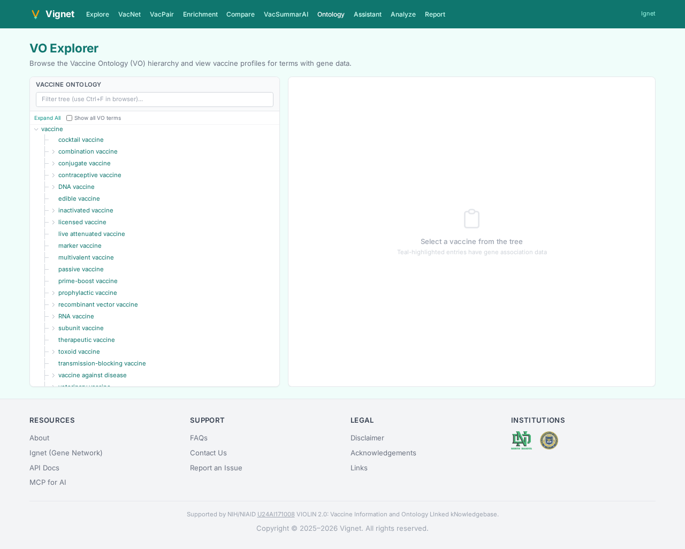

---

### Vaccine Assistant — Q&A

**Purpose**: Ask natural language questions about vaccine-gene interactions and get evidence-grounded answers citing supporting literature.

**How to Use**:

1. **Ask Questions**: Type your question in the text field. The assistant understands questions like:
   - "What genes are associated with COVID-19 vaccines?"
   - "How does the influenza vaccine interact with immune response genes?"
   - "Which vaccines target the ACE2 pathway?"
   - "What is the relationship between BCG vaccine and TNF?"

2. **View Answer**: The assistant provides an answer grounded in PubMed literature with citations including:
   - Supporting evidence and PMID references
   - Gene/pathway involvement
   - Confidence indicators

3. **Verify Sources**: Click on PMID citations to view the original abstract on PubMed.

4. **Ask Follow-ups**: Refine your question based on the answer or ask about related topics.

**Understanding Answers**:

- **Citation Count**: More citations indicate stronger evidence
- **Consistency**: If multiple papers say the same thing, confidence is higher
- **Mechanism Explanations**: The assistant explains *why* associations exist, not just that they do

**Tips for Better Questions**:

- Use gene symbols (ACE2, not angiotensin converting enzyme)
- Be specific: "COVID-19 vaccine immune response genes" is better than "vaccines and genes"
- Ask about mechanisms: "How does..." questions get mechanistic explanations
- Ask for comparisons: "Which is better..." questions compare vaccines
- Verify important findings: Use VacPair to see the raw co-occurrence data

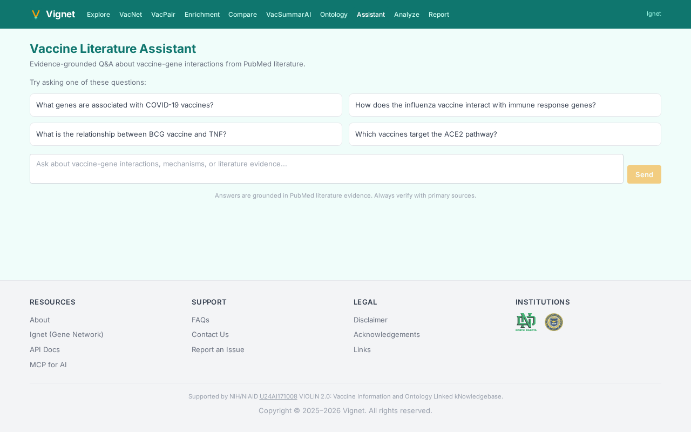

---

### Analyze Text

**Purpose**: Paste biomedical text (abstracts, sentences, or paragraphs) and get gene and vaccine mentions detected plus predicted protein-protein interactions using BioBERT.

**How to Use**:

1. **Paste Text**: Click "Step 1: Paste Biomedical Text" and paste your text into the large text area. Text can be:
   - Single or multiple PubMed abstracts
   - Research paper excerpts
   - Clinical notes (de-identified)
   - Any biomedical literature

2. **Optional: Try Sample**: Click "Try Sample Text" to see an example with results.

3. **Run Analysis**: Click "Detect Genes" to analyze the text.

4. **Review Results** (multi-step process):
   - **Step 1 Results**: Identified gene symbols and vaccine terms
   - **Step 2 - Confirm Genes**: Review detected terms, add or remove as needed
   - **Step 3 - Results**: See predicted interactions and co-occurrence summaries

5. **Interaction Predictions**: The tool shows:
   - **Gene Pairs**: Proteins that may interact based on context and BioBERT scores
   - **Vaccine-Gene Links**: Predicted interactions even if not explicitly mentioned
   - **Confidence Scores**: Machine learning confidence (0-1) for each prediction

**Understanding Results**:

- **Detected Genes**: Gene symbols correctly extracted from text (matches PubMed NER)
- **Vaccine Mentions**: Vaccine terms recognized and mapped to VO IDs
- **BioBERT Score**: Probability the two entities actually interact (not just mentioned together)
- **Context**: Tool considers word proximity and sentence structure

**Tips for Better Analysis**:

- Clean text: Remove non-ASCII characters and special symbols
- Use technical language: Avoid casual descriptions; the tool expects biomedical terminology
- Be specific: Full abstracts work better than single sentences
- Verify important predictions: Use VacPair to confirm predictions from real literature

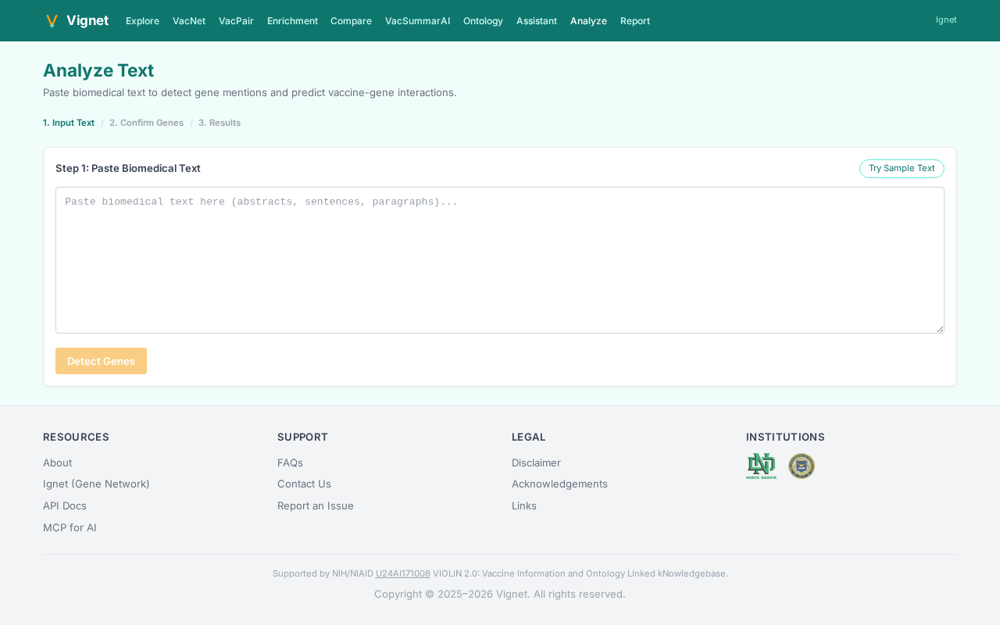

---

### Generate Report

**Purpose**: Create comprehensive downloadable HTML reports analyzing vaccine-gene associations for a gene list.

**How to Use**:

1. **Enter Gene List**: Paste gene symbols (comma-separated or one per line) into the gene list field. Example: "ACE2, TMPRSS2, IL6, TNF"

2. **Optional: Load Example**: Click "Load Example" to see results with a pre-loaded immune gene list.

3. **Generate**: Click "Generate Report" to start multi-phase report generation:
   - **Phase 1**: Parsing genes and validating symbols
   - **Phase 2**: Finding associated vaccines for each gene
   - **Phase 3**: Computing enrichment statistics
   - **Phase 4**: Generating literature summaries

4. **Review Report**: The report includes:
   - **Gene Summary**: Input genes with mention counts
   - **Associated Vaccines**: Ranked by coverage and significance
   - **Network Diagrams**: Visual representation of vaccine-gene associations
   - **Evidence Tables**: Supporting citations and PMIDs
   - **Pathway Analysis**: Biological themes across associated vaccines

5. **Download**: Once generated, download the complete HTML report as a standalone file.

**Report Contents**:

- **Executive Summary**: 2-3 paragraph overview of findings
- **Methods**: Data sources and analysis approach
- **Results**: Tables, figures, and statistics
- **References**: Complete PMID citations with links to PubMed
- **Appendix**: Detailed gene-by-gene breakdown

**Tips for Report Generation**:

- Use 10-100 genes for comprehensive results
- Focus on genes from one study/pathway for coherent narratives
- Download immediately after generation (reports expire after session)
- Good for: manuscripts, grant applications, regulatory documentation
- The report is publication-ready with institutional logos

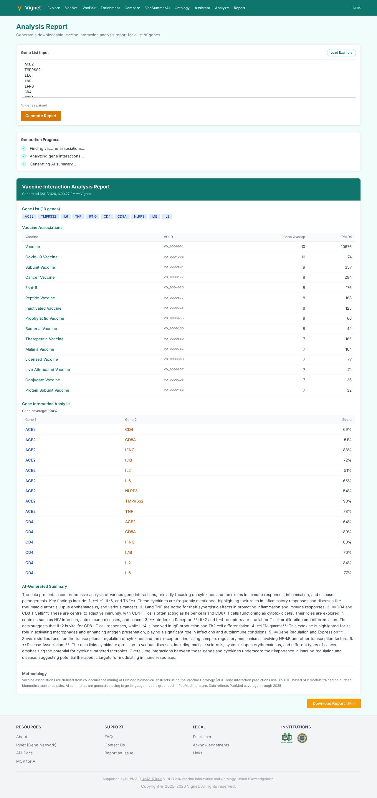

---

## API Access

### REST API

For programmatic access to Vignet data, use the REST API at `https://ignet.org/api/v1/`.

**Common Endpoints**:

- `/vaccine/search` - Search vaccines by name or VO ID
- `/vaccine/{vo_id}/genes` - Get genes associated with a vaccine
- `/pair/search` - Query vaccine-gene co-occurrence evidence
- `/enrichment/analyze` - Run enrichment analysis on a gene list
- `/text/analyze` - Detect genes and vaccines in biomedical text

**Documentation**: See [API Docs](https://ignet.org/api/docs/) for complete reference with request/response examples.

**Authentication**: No authentication required; API is open to public users.

**Rate Limiting**: 100 requests per minute per IP address; contact support for higher limits.

### MCP Endpoint for AI Assistants

Vignet provides a Model Context Protocol (MCP) endpoint for integrating with AI assistants including Claude and other large language models.

**Endpoint**: `https://ignet.org/api/v1/mcp`

**Capabilities**:

- Query vaccine-gene associations in natural language
- Retrieve evidence and citations automatically
- Generate summaries of vaccine mechanisms
- Analyze gene lists for vaccine associations

**Use Cases**:

- AI-powered literature analysis tools
- Automated vaccine research report generation
- Integration with Claude-based research assistants
- Custom knowledge bases for drug discovery

**Setup**: See [MCP for AI](https://ignet.org/docs/mcp/) for integration examples with Claude Code and other platforms.

---

## FAQ

**Q: How often is the database updated?**
A: PubMed literature is mined and added on a monthly basis. The current database reflects literature through 2025. Check the home page for the latest update date.

**Q: Can I use Vignet data in publications?**
A: Yes. Please cite as: "Vignet: A vaccine-focused integrative gene network database from PubMed literature mining. University of North Dakota / University of Michigan, 2025-2026."

**Q: Why does a vaccine have no genes associated?**
A: The vaccine may not have been mentioned with genes in PubMed articles, or it may be a newly approved vaccine not yet published in scientific literature. The Vaccine Ontology is comprehensive but literature coverage varies.

**Q: Can I download the full database?**
A: The full database is available for academic research. Contact support at [contact link] with your institutional affiliation for bulk data access.

**Q: What does the BioBERT score mean?**
A: It's a machine learning confidence score (0-1) for protein-protein interaction. Scores >0.7 indicate likely interactions; <0.3 are speculative. Always verify important findings in the literature.

**Q: How do I report incorrect data or missing vaccines?**
A: Use "Contact Us" at the bottom of the page. Include the vaccine/gene name and the error. We review reports monthly.

**Q: Is Vignet available as a REST API?**
A: Yes, at https://ignet.org/api/v1/. Documentation is at https://ignet.org/api/docs/.

**Q: Can I integrate Vignet into my research platform?**
A: Yes. The REST API and MCP endpoint support integration. See [API Docs](https://ignet.org/api/docs/) for examples.

**Q: What browsers are supported?**
A: Modern browsers (Chrome 90+, Firefox 88+, Safari 14+, Edge 90+). Mobile browsers supported but optimized for desktop.

---

## Citation

If you use Vignet in your research, please cite as:

Vignet: A vaccine-focused integrative gene network database from PubMed literature mining. Junguk Hur (University of North Dakota) and Yongqun "Oliver" He (University of Michigan), 2025-2026. Supported by NIH/NIAID U24AI171008 VIOLIN 2.0.

BibTeX:
```
@database{vignet2025,
  author = {Hur, Junguk and He, Yongqun},
  title = {Vignet: A vaccine-focused integrative gene network database},
  year = {2025},
  url = {https://ignet.org/vignet/},
  note = {Supported by NIH/NIAID U24AI171008 VIOLIN 2.0}
}
```

---

## Contact & Support

For questions, bug reports, or feature requests:

- **FAQs**: https://ignet.org/vignet/faqs/
- **Contact Us**: https://ignet.org/vignet/contact/
- **Report an Issue**: https://ignet.org/vignet/report-issue/
- **Acknowledgments**: https://ignet.org/vignet/acknowledgments/

---

## Related Resources

- **Ignet** (Sister Project): Gene-gene interaction networks
  https://ignet.org/

- **Vaccine Ontology**: Official VO documentation
  https://bioportal.bioontology.org/ontologies/VO

- **PubMed**: Original source literature
  https://pubmed.ncbi.nlm.nih.gov/

- **VIOLIN** (Vaccine Information and Ontology Linked kNowledgebase):
  http://www.violinet.org/

- **BioBERT**: Machine learning model used for interaction prediction
  https://arxiv.org/abs/1901.08746

---

**Last Updated**: March 2026
**Version**: 2.0
**Copyright**: Vignet, University of North Dakota & University of Michigan
